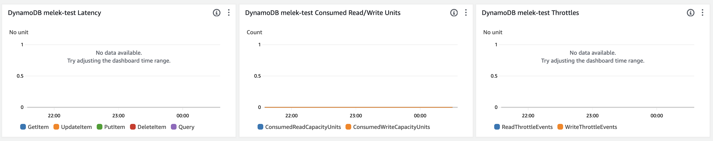

# Inception Secure Store

The package `@inception-health/cdk-secure-store` is a NodeJS CDK package that contains primarily the `Secure Store` construct.

`Secure Store` is a construct that creates a secure DynamoDB table conformant to Inception Health HIPAA compliance and policies.

## Installation

```bash
pnpm i @inception-health/cdk-secure-store
```

## Usage

```typescript
import { SecureStore } from '@inception-health/cdk-secure-store';
import { Stack } from '@aws-cdk/core';
import { Key } from '@aws-cdk/aws-kms';

const stack = new Stack();

const myKey = new Key(stack, 'MyKey');

const store = new SecureStore(stack, 'MySecureStore', {
  tableName: 'my-table',
  encryptionKey: myKey,
});
```

## Specifications

### Global Secondary Index

By default, the `SecureStore` provides an general Global Secondary Index (GSI) that can be used as the default overloaded secondary index for single-table design. The primary reason for using GSIs is to enhance query capabilities. While DynamoDB requires every query to specify the partition key, the constraints of querying only by the primary key can limit application design. GSIs provide the flexibility to query data using non-primary key attributes, enabling more efficient data access patterns without resorting to full table scans.

A default GSI available in the `SecureStore` consists of an alternate partition key and, an alternate sort key, allowing you to query data that isn't organized according to the table's primary key. This means you can perform queries and get items based on other attributes that are not part of the primary key. GSIs are separate from the table and are asynchronously updated as data in the base table changes. This separation allows for considerable flexibility but requires careful consideration regarding data consistency and latency.

The implementation of the default GSI to permit overloading is based on the following:

- **Attribute Naming**: Use generic attribute names for the GSI's partition and sort keys: `GSI1PK` for the GSI partition key and `GSI1SK` for the sort key. These keys can then hold values specific to different access patterns. For example, GSI1PK might contain values like USER#<UserId> for user data and ORDER#<OrderId> for order data.
- **Data Encoding**: Values within these keys can encode multiple pieces of information using delimiters (e.g., ORDER#<UserId>#<Date>), allowing for queries against the GSI to retrieve data based on the user, order, or date.

The benefits of a default GSI are:
- **Cost Efficiency**: Reduces the need for multiple GSIs, each of which would consume additional read and write capacity, thereby helping manage costs.
- **Simplified Management**: Having fewer indices simplifies table management and can improve application maintainability.
- **Flexible Access Patterns**: Supports diverse querying needs without full table scans, enhancing application performance and user experience.

For more information about using global GSI, you can read [this excellent article](https://www.trek10.com/blog/best-practices-for-secondary-indexes-with-dynamodb).

### Granting Access 

The `SecureStore` class provides methods to grant read, write, or read/write access to the DynamoDB table. These methods can be used to permit an IAM principal to perform data operations on the table.

#### Grant Read Access

To grant an IAM principal all data read operations on the table, use the `grantReadData` method. This includes actions like `BatchGetItem`, `GetRecords`, `GetShardIterator`, `Query`, `GetItem`, `Scan`, and `DescribeTable`.

```typescript
secureStore.grantReadData(grantee);
```

#### Grant Write Access

To grant an IAM principal all data write operations on the table, use the `grantWriteData` method. This includes actions like `BatchWriteItem`, `PutItem`, `UpdateItem`, `DeleteItem`, and `DescribeTable`.

```typescript
secureStore.grantWriteData(grantee);
```

#### Grant Read/Write Access

To grant an IAM principal all data read and write operations on the table, use the `grantReadWriteData` method. This includes all the actions allowed by `grantReadData` and `grantWriteData`.

```typescript
secureStore.grantReadWriteData(grantee);
```

> **Note**: If a customer-managed KMS key is associated with the table, the appropriate grants will also be added to the KMS key.


## Props

| Property               | Required | Description                                               | Default Value                  |
| ---------------------- | :------: | --------------------------------------------------------- | ------------------------------ |
| tableName              |   Yes    | The name of the DynamoDB table.                           | -                              |
| encryptionKey          |   Yes    | The AWS KMS key to use for encrypting the DynamoDB table. | -                              |
| partitionKey           |    No    | The partition key for the DynamoDB table.                 | `{ name: 'PK', type: 'HASH' }` |
| sortKey                |    No    | The sort key for the DynamoDB table.                      | `{ name: 'SK', type: 'HASH' }` |
| backupEnabled          |    No    | Whether to enable AWS Backup for the DynamoDB table.      | true                           |
| removalPolicy          |    No    | The removal policy for the DynamoDB table.                | `RemovalPolicy.RETAIN`         |
| devOpsTopicArn         |   Yes    | The SNS topic to send DevOps notifications to.            | -                              |
| globalSecondaryIndexes |    No    | One or more global secondary indexes (GSIs).              | -                              |
| localSecondaryIndexes  |    No    | One or more local secondary indexes (LSIs).               | -                              |

## Monitoring and Alerting

The secure store construct includes comprehensive monitoring features to ensure the health and performance of the DynamoDB table. These features include metrics, alarms, and a dashboard.

### Metrics

The secure store construct includes comprehensive monitoring features to ensure the health and performance of the DynamoDB table. These features include widgets for various metrics and alarms.

### Widgets


Widgets are visual representations of the metrics and alarms that you can add to your dashboard. They provide a quick overview of the status and health of your resources. The following widgets are included:

- **Latency**: This widget tracks the time it takes for a request to travel from the sender to the receiver and for the receiver to process that request. In the context of DynamoDB, it could refer to the time taken to read or write data to the table. Our current latency widget tracks the latency of the `GetItem`, `UpdateItem`, `PutItem`, `DeleteItem`, and `Query` events.

- **Consumed Read/Write Units**: This widget tracks the number of read and write capacity units that your application has used. If you're consistently using more units than you have provisioned, you may need to increase your capacity. In case we use OnDemand privisionning (which is the default option of the `Secure Store`), the read and write capacity are important to follow and monitor.

- **DynamoDB Read/Write Throttle Events**: This widget tracks the number of read or write throttle events. Throttling occurs when the number of read or write requests exceeds the provisioned throughput for a table or a global secondary index.

To add the widget to a dashboard, you can use the following code:

```typescript
dashboard = new aws_cloudwatch.Dashboard(this, "dashboard")
// Add the store widgets to the dashboard
store.addWidgetsToDashboard(dashboard);
```

### Alarms

Alarms are set up to alert you when certain thresholds are crossed. For example, if the number of read or write throttle events exceeds a certain limit, an alarm will be triggered. The following alarms are included:

- **DynamoDB Table Reads/Writes Throttled**: This alarm is triggered when the number of read or write throttle events exceeds ONE event over a period of 30 minutes.

- **DynamoDB Errors > 0**: This alarm is triggered when there are any system errors with DynamoDB. The alarm monitors a range of operations including `TRANSACT_WRITE_ITEMS`, `TRANSACT_GET_ITEMS`, `BATCH_GET_ITEM`, `BATCH_WRITE_ITEM`, `QUERY`, and `SCAN`.

Remember to configure the necessary permissions and roles to access these monitoring features.

In order to test the Cloudwatch Alarm and check if it triggers notifications, you can use the following command:

```cli
aws cloudwatch set-alarm-state --alarm-name "<CLOUDWATCH_ALARM_NAME>" --state-reason "Testing the Amazon Cloudwatch alarm" --state-value ALARM
```

_Note_: If Slack notification is not triggered, it is likely that the (1) SNS topic Access Policy is not updated to include access to the `cloudwatch.amazonaws.com` to `SNS:Publish` and/or (2) KMS Key Access Policy used to encrypt the SNS topic does not include `cloudwatch.amazonaws.com` to Decrypt/Encrypt. 


## Security and HIPAA Compliance

`SecureStore` is designed with security and HIPAA compliance in mind. It is configured by default to be highly secure, encrypted at-rest and in-transit, and has the right backup and protection in place.

`Secure Store` was designed to offer high availability, resilient disaster recovery configuration, and continuous backup. Both Availability and Disaster Recovery rely on the same best practices such as monitoring for failures, deploying to multiple locations, and automatic failover. However Availability focuses on components of the workload, while Disaster Recovery focuses on discrete copies of the entire workload. Disaster Recovery has different objectives from Availability, focusing on time to recovery after a disaster.

## Encryption

`SecureStore` encrypts all data at rest using the provided AWS KMS key. This ensures that your sensitive data is secure and complies with HIPAA requirements for data encryption.

The core component of `Secure Store` is a DynamoDB Global Table. Amazon DynamoDB offers DynamoDB encryption, which allows to encrypt databases using keys that we manage through AWS KMS. On a database instance running with Amazon DynamoDB encryption, data stored at-rest in the underlying storage is encrypted as are automated backups, read replicas, and snapshots.

`Secure Store` requires a custom managed KMS Key to be passed. It is then used to encrypt the data at-rest in DynamoDB, the automated backups, read replicas and snapshots.

### KMS Key Configuration for DynamoDB

The DynamoDB table in our application uses a KMS Key for encryption. This key is also used for encrypting backups, logs, and the SNS topic for DevOps notifications.

***Important Notice***: The KMS Key must have specific policies attached to it. Without these policies, the EventBridge rule will not be able to send notifications to the SNS topic.

The KMS Key must have the following required policies:

1. Allow access to CloudWatch Log for `logs.REGION.amazonaws.com` service. The actions allowed include `kms:Encrypt`, `kms:Decrypt`, `kms:ReEncrypt*`, `kms:GenerateDataKey*`, and `kms:DescribeKey`. The condition for this policy is that the `kms:EncryptionContext:aws:logs:arn` should be like `arn:aws:logs:REGION:ACCOUNT_ID:*`.

```json
{
    "Sid": "Allow access to CloudWatch Log",
    "Effect": "Allow",
    "Principal": {
        "Service": "logs.REGION.amazonaws.com"
    },
    "Action": [
        "kms:Encrypt",
        "kms:Decrypt",
        "kms:ReEncrypt*",
        "kms:GenerateDataKey*",
        "kms:DescribeKey"
    ],
    "Resource": "*",
    "Condition": {
        "ArnLike": {
            "kms:EncryptionContext:aws:logs:arn": "arn:aws:logs:REGION:ACCOUNT_ID:*"
        }
    }
}
```

2. Allow access to CloudWatch Log for `events.amazonaws.com` service. The actions allowed are the same as the first policy.

```json
{
    "Sid": "Allow access to EventBridge",
    "Effect": "Allow",
    "Principal": {
        "Service": "events.amazonaws.com"
    },
    "Action": [
        "kms:Encrypt",
        "kms:Decrypt",
        "kms:ReEncrypt*",
        "kms:GenerateDataKey*",
        "kms:DescribeKey"
    ],
    "Resource": "*",
    "Condition": {
        "ArnLike": {
            "kms:EncryptionContext:aws:events:arn": "arn:aws:events:<REGION>:<AWS_ACCOUNT>:*"
        }
    }
}
```

3. Allow access to Cloudwatch Alarms from `cloudwatch.amazonaws.com` service. The actions allowed are the same as the first policy

```json
{
    "Sid": "Allow access to CloudWatch Alarms",
    "Effect": "Allow",
    "Principal": {
        "Service": "cloudwatch.amazonaws.com"
    },
    "Action": [
        "kms:Encrypt",
        "kms:Decrypt",
        "kms:ReEncrypt*",
        "kms:GenerateDataKey*",
        "kms:DescribeKey"
    ],
    "Resource": "*",
    "Condition": {
        "ArnLike": {
            "kms:EncryptionContext:aws:cloudwatch:arn": "arn:aws:cloudwatch:<REGION>:<AWS_ACCOUNT>:*"
        }
    }
}
```

Please ensure these policies are correctly attached to the KMS Key to avoid any disruptions in the functionality of the application.

## High availability and durability

Leveraging DynamoDB's built-in high availability makes it a suitable choice for critical business applications that require consistent, single-digit millisecond latency at any scale.

High Availability is managed through two-layered architecture of our DynamoDB Database: 
- Availability Zones in each AWS Region.
- Global Table configuration to manage multiple AWS Regions.

#### Availability Zones

All of the data in our `Secure-Store` is stored on solid-state disks (SSDs) and is automatically replicated across multiple [Availability Zones](https://docs.aws.amazon.com/whitepapers/latest/get-started-documentdb/aws-regions-and-availability-zones.html) in any given AWS Region, providing built-in high availability and data durability at a single region. This means that in the event of an outage in one zone, DynamoDB can automatically failover to another zone where your data is replicated. This ensures that your DynamoDB tables are available and can serve traffic even in the face of a zone outage.

> Note: By default, all Inception Health infrastructure is deployed in at least two Availability Zones in the `US-EAST-1` region of AWS. 

#### Global Table Configuration (optional)

> By default, we have not yet enabled multiple replicas for the Global Table. If you are interested in leveraging global tables, please reach to @meleksomai and @WSanders31.

In addition, `Secure Store` leverages the **AWS DynamoDB global tables**. Global tables is a fully managed, serverless, multi-Region, and multi-active database. Global tables provide 99.999% availability, increased application resiliency, and improved business continuity. As global tables replicate tables automatically across our choice of AWS Regions, we are able to achieve fast, local read and write performance. Global tables can provide active-active replication across multiple AWS Regions, further enhancing the availability of your data.

In the rare event of a single Region failure, there is no need for a database failover as global tables’ multi-active architecture allows to read and write to any replica table. Global tables also eliminate the difficult work of replicating data between Regions and resolving update conflicts for multi-active workloads. In addition, global tables enable applications to stay highly available even in the rare event of isolation or degradation of an entire Region.

In other terms, global tables is an active-active approach where all regions serve the traffic. 

When creating a global DynamoDB table, it consists of several replica tables (one per region) that DynamoDB treats as a single unit. Each replica has the same table name and the same primary key schema. When an application writes data to a replica table in a region, DynamoDB propagates the write to the other replica tables in other AWS regions automatically.

> **Consistency and Conflict Resolution**
> An application can read and write data to any replica table. If your application uses only eventually consistent reads and only problem reads in an AWS Region, it will work without any modification. However, if the application requires strongly consistent reads, it should perform all of its strongly consistent reads and writes in the same region. DynamoDB doesn’t support strongly consistent cross-region reads. Therefore, if you write to one region and read in another, the response read might include stale data that doesn’t reflect the results of newly completed writes in the other region.

_[Excerpts from AWS Documentation](https://docs.aws.amazon.com/amazondynamodb/latest/developerguide/V2globaltables_HowItWorks.html)_

## Disaster Recovery

This section has been heavily inspired and shamelessly copied from this [great online workshop](https://disaster-recovery.workshop.aws/en/intro/disaster-recovery.html).

### Configuration

Since `Secure Store` leverages DynamoDB, it can use a combination of two strategies that can be used with AWS DynamoDB as Disaster Recovery options:
- Point in time recovery
- On-demand backups

#### Point-In-Time Recovery (PITR)

`SecureStore` supports DynamoDB's Point-In-Time Recovery (PITR) feature. This allows our engineering team to restore any table to any point in time within the last 35 days, providing protection against accidental write or delete operations. For more information about PITR in Amazon DynamoDB, please refer to [the official documentation](https://aws.amazon.com/dynamodb/pitr/).

PITR is very powerful since it does not consume any provisioned table capacity and has no impact on the performance or availability of the production applications. PITR is enabled by default on `Secure Store` tables of any size.

#### On-Demand Backup

To complement PITR, we are enabling by default `On-Demand Backup`. The backup is completed **daily, weekly, and monthly with a retention period of 7 years**. This approach is mainly used for long-term retentions and archiving purposes.

Most importantly, the on-demand backup and restore process won't affect the application performance or API latencies. It scales as necessary and completes the backups in a short time regardless of the table size. In addition, all on-demand backups are cataloged, made discoverable, and retained until they are explicitly deleted.

### Definitions

Having a disaster recovery plan is more than having backup routines and redundant components. We should define what the Recovery Time (RTO) and  Recovery Point (RPO) objectives are for disaster recovery. WE usually recommend settings objectives based on business metrics.

**Recovery Time Objective (RTO)**: is the maximum acceptable delay between service interruption and service restoration. This determines what is considered an acceptable time window when the service is unavailable.

**Recovery Point Objective (RPO)**: is the maximum acceptable time since the last data recovery point. This determines what is considered an acceptable loss of data between the last recovery point and the service outage.

### Strategy

When a disaster occurs, you will accomplish your DR strategy using these steps:

- Detect the impact of the disaster event on your workload
- Restore infrastructure, data, and re-integrate these to enable your workload to operate
- Fail over, re-routing requests to the recovery Region

#### Detection

To reduce recovery time, detection is automated. We use Amazon EventBridge to monitor for critical events such as the deletion, update, or creation of a `Secure Store`. 

EventBridge allows us to create rules that match these events and then route them to targets for processing. In our case, the target is AWS ChatBot. AWS ChatBot is an interactive agent that makes it easy to monitor and interact with AWS resources in our Slack channels. When an event occurs, EventBridge triggers AWS ChatBot, which then sends a message to our DevOps team's Slack channel. This allows our team to quickly respond to any critical changes to our Secure Store.

The current rules that we notify our DevOps team are related to:

- `CreateTable`
- `DeleteTable`
- `UpdateTable`
- `DeleteBackup`
- `RestoreTableFromBackup`
- `RestoreTableToPointInTime`

To read more about EventBridge and ChatBot integration, please follow [this documentation](https://docs.aws.amazon.com/chatbot/latest/adminguide/create-eventbridge-rule.html).

##### SNS Topic Requirements

The SNS topic used for notifications must meet the following requirements:
- The SNS topic must have a KMS key that allows SNS to use the Decrypt and Encrypt operations. This is necessary to protect the data in the notifications.
- The access policy for the SNS topic must include `events.amazonaws.com``. This allows EventBridge to send messages to the topic.

#### Restore

[Source](https://aws.amazon.com/blogs/architecture/disaster-recovery-dr-architecture-on-aws-part-ii-backup-and-restore-with-rapid-recovery/)

#### Failover

### Best practices (WIP)

Both Availability and Disaster Recovery rely on the same best practices such as monitoring for failures, deploying to multiple locations, and automatic failover. 

- `REL13-BP01` Define recovery objectives for downtime and data loss
- `REL13-BP02` Use defined recovery strategies to meet the recovery objectives
- `REL13-BP03` Test disaster recovery implementation to validate the implementation
- `REL13-BP04` Manage configuration drift at the DR site or Region
- `REL13-BP05` Automate recovery

## Customization

`SecureStore` is highly customizable. You can provide your own partition key and sort key, enable or disable deletion protection, and specify your own removal policy. See the [Usage](#usage) section for more details.

## Disaster Recovery Scenario

Let's say a data deletion incident occurred on March 1, 2023, at 3:00 PM UTC. The engineering team discovered the incident on March 2, 2023, at 9:00 AM UTC. Here's how you can recover the data using PITR and On-Demand Backup.

### Using Point-In-Time Recovery (PITR)

1. Go to the AWS Management Console, navigate to the DynamoDB service, and select the table you want to restore.
2. Choose the `Backups` tab and then `Restore to point-in-time`.
3. AWS DynamoDB allows you to restore your table to any point in time during the last 35 days. Select the specific date and time (March 1, 2023, 2:59 PM UTC) to restore your table.
4. Enter a new table name for the restored table and choose `Restore`.
5. After the restore operation is completed, verify the data in the new table.

### Using On-Demand Backup

1. Go to the AWS Management Console, navigate to the DynamoDB service, and select the table you want to restore.
2. Choose the `Backups` tab. You will see a list of all on-demand backups for the table.
3. Choose the backup taken before the data deletion incident occurred (e.g., the backup from March 1, 2023, 2:00 AM UTC).
4. Choose `Restore backup`, enter a new table name for the restored table, and choose `Restore`.
5. After the restore operation is completed, verify the data in the new table.

Remember, restoring a table from a backup or to a point in time creates a new table. You need to update your application to start using the new table after the restore operation is completed.

## FAQs

## FAQs

**Q: What is the Secure Store?**

A: Secure Store is a construct that creates a secure DynamoDB table conformant to Inception Health HIPAA compliance and policies.

**Q: How do I use the Secure Store?**

A: You can use the Secure Store by importing it from the `@inception-health/cdk-secure-store` package and creating a new instance of it. See the [Usage](#usage) section for more details.

**Q: What is the default configuration for the Secure Store?**

A: By default, Secure Store creates a DynamoDB table with deletion protection enabled, AWS Backup enabled, and a removal policy of `RemovalPolicy.RETAIN`. The default partition key is `{ name: 'PK', type: aws_dynamodb.AttributeType.STRING }` and the default sort key is `{ name: 'SK', type: aws_dynamodb.AttributeType.STRING }`.

**Q: Can I customize the Secure Store?**

A: Yes, Secure Store is highly customizable. You can provide your own partition key and sort key, enable or disable deletion protection, and specify your own removal policy.

**Q: What is the disaster recovery strategy for the Secure Store?**

A: Secure Store supports DynamoDB's Point-In-Time Recovery (PITR) feature, which allows you to restore any table to any point in time within the last 35 days. In addition, we enable `On-Demand Backup` by default. The backup is completed daily, weekly, and monthly with a retention period of 7 years.

**Q: What is the global table configuration?**

A: Secure Store leverages the AWS DynamoDB global tables, which provide 99.999% availability, increased application resiliency, and improved business continuity. However, by default, we have not yet enabled multiple replicas for the Global Table.

**Q: What should be the policy for the DevOps for the SNS topic?**

A: The SNS Topic that is required to get notifications from the `SecureStore` must at least grant access to `cloudwatch` and `eventBridge`. A sample example below:

```json
{
  "Version": "2012-10-17",
  "Statement": [
    {
      "Sid": "0",
      "Effect": "Allow",
      "Principal": {
        "Service": "events.amazonaws.com"
      },
      "Action": "sns:Publish",
      "Resource": "arn:aws:sns:<AWS_REGION>:<AWS_ACCOUNT>:devops"
    },
    {
      "Effect": "Allow",
      "Principal": {
        "Service": "cloudwatch.amazonaws.com"
      },
      "Action": "SNS:Publish",
      "Resource": "arn:aws:sns:<AWS_REGION>:<AWS_ACCOUNT>:devops",
      "Condition": {
        "StringEquals": {
          "aws:SourceAccount": "<AWS_ACCOUNT>"
        },
        "ArnLike": {
          "aws:SourceArn": "arn:aws:cloudwatch:<AWS_REGION>:<AWS_ACCOUNT>:alarm:*"
        }
      }
    }
  ]
}
```